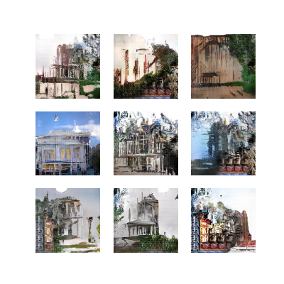
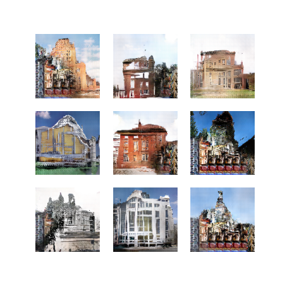
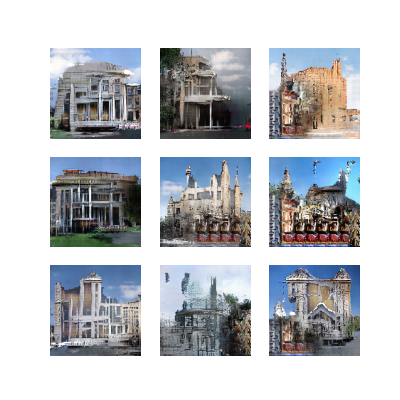
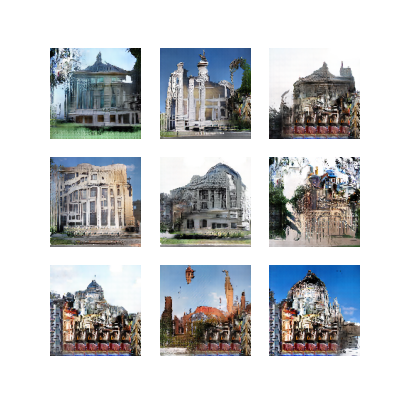

# 3D-scene-generator
## Authors: Oskar Kuliński, Kajetan Ożóg

Datesets used:   
https://www.kaggle.com/datasets/itsahmad/indoor-scenes-cvpr-2019?select=TrainImages.txt   
https://www.kaggle.com/datasets/wwymak/architecture-dataset

A generative adversarial network creating images of buildings in 128x128 resolution

    Usage:
    run the file cli.py e.g. in terminal:
        python cli.py

If you want to use the model trained by us, choose to load an existing model,
otherwise download the architecture dataset linked above, 
and extract all the class directories that you wish to use into selected_data.

## Sample images

