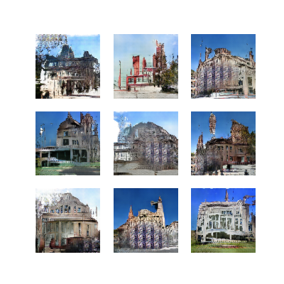

1. Test and Training Results:   
- The results are best viewed by running the model
and admiring the generated images. They resemble buildings,
but they lack detail and sometimes have unrealistic shapes.
     

2. Justification for Choice of Technique/Model:   
- We chose GAN architecture because of its
simplicity, the ease of controlling effects, and the high adjustibility of parameters.   

     
3. Data Splitting Strategy: 
- We do not split the data, testing is done visually,
due to the difficulty of measuring the effects of GAN without a separate model.
We do not use validation, because until the very end of the work we did not have a problem with the results of the
discriminator. We had planned to add validation if such a problem arose,
but there was no such need. Due to the absence of problems with discriminator results,
we considered increasing the training set more valuable than adding validation.   

4. Description of Input Data:
- Initially, we used a set of room images,
narrowed down to 5 classes, then we increased the number of classes to 10, which significantly degraded the results,
The images were much more blurry and only occasionally formed
realistic objects, such as chairs or book cabinets.

- Finally, we changed the dataset to images of buildings, as we were unable to make
significant progress for 5 days. We decided that photos of rooms might contain too many
varied objects, and after short tests the results on architecture were much more
promising than on rooms. Simpler shapes and less variety had a very positive effect on the model's results. 
- For the latest version of the model, we cut out images of pyramids (ancient Egyptian architecture),
which, due to their unusual shape, worsened the realism of the generated images.

- We reduced the images to 128x128 resolution and scaled them to [-1;1]   
- We shuffled the data to include a variety of photos in each batch   

5. Results Analysis:
- At first the results were terrible, changes to the model did not help, after 2 days
it turned out that the error lay in the training function. After correcting, the results started
get better and better, we reduced the learning rate, added normalization and dropout. 
Then we changed the number of layers and filters, but failed to get realistic
shapes. Changing the convolution to transpose convolution in the generator helped. 
This greatly improved the realism of the results. After adjusting the momentum in the normalization 
(0.7 was too small, 0.9 too large, the model learned very slowly), 
beta_1 in learning rate to 0.5, as recommended in the paper https://arxiv.org/abs/1511.06434
The results were not bad, but the model regularly after about 300 - 500 epochs stopped making 
any progress, and was not generating very realistic images. We tried 
simplify the discriminator, which helped slightly, but the results were still not very 
realistic. We tried changing the classes used, and then increased the number of
classes to 10, but this produced the opposite results, the model produced a 
more blurry shapes, and generated objects like chairs and cabinets less often.   

- Then we tried changing the dataset to architectural photos. 
On this dataset, the results were quite satisfactory in a very short time. 
As no significant progress has been made on the room dataset for 5 days,
we made the decision to switch to the architecture dataset and get rid of the division
into classes, in order to simplify the model. We simultaneously tested a version of the generator
with increasing the size of the images using upsampling and strides=2 in the convolution transpose.
The version without upsampling yielded better results, generating quite a variety of 
photos, many of which resembled buildings to a fair degree. For the first time 
discriminator proved to be a limitation, the generator was able to regularly 
fool him. We decided to add more filters in the discriminator.
This helped slightly, and this is how the final model looks.

- The final results are quite satisfactory, further improvement would require
considerable computing power and time, but should not require major changes to the
parameters or model structure. The shapes are somewhat irregular, the buildings often 
look not fully completed, the effect is somewhat dystopian, but it should be possible to bring it to realism.

6. Learning summary:
- learning rate around 1.5e-4 gave the best results, at significantly higher   
there was no convergence, with less the model learned too slowly   
- in the generator transpose convolution worked best, in the discriminator
ordinary convolution   
- strides in convolution somewhat stabilized learning, compared to
upsampling/downsampling   
- dropout with certain models improved results, but when we changed the dataset
led to the generation of single-color blobs in images   
- batch normalization improved results, with a momentum of 0.8, higher caused too
slow learning, a smaller one led to instability   
- in the final version of the model, after about 700-800 epochs the corrections were small    
- dense layers in the generator or discriminator worsened the results   
- class division worsened the results and would require a more complex model    
- batch size we set the largest that hardware limitations allowed us to    

7. Next steps:
- it is possible to strengthen both the generator and the discriminator by increasing the number of flitches, 
however, this would require more powerful equipment than we had available and a significant amount of 
time   
- increasing the batch size could improve learning stability   
- returning to class division would be possible, but would require increasing both the
number of filters and, most likely, longer learning time   
- adding validation would make it easier to evaluate discriminator results, which could be valuable
in fine tuning the model, as the final phases of the project succeeded in bringing the
model to a state of balance.    

8. Example images generated every 100 epochs

Before learning  

After 100 epochs      

After 200 epochs   

After 300 epochs  

After 400 epochs   

After 500 epochs   

After 600 epochs   

After 700 epochs   

After 800 epochs   

After 900 epochs   

After 1000 epochs   

