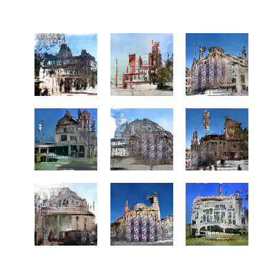
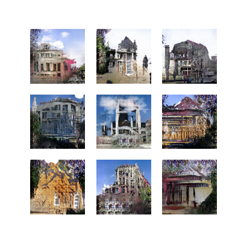
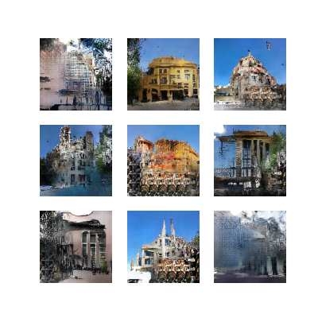

1. Wyniki Testowe i Treningowe: 
- Wyniki najlepiej oglądnąć uruchamiając model
i podziwiając wygenerowane obrazy. Przypominają budynki, 
ale brak im szczegółów i pojawiają się nierealistyczne kształty.   
     

2. Uzasadnienie Wyboru Techniki/Modelu: 
- Wybraliśmy architekturę GAN, ze względu na
jej prostotę, łatwość kontrolowania efektów, oraz dużą możliwość dostosowywania parametrów.   

     
3. Strategia Podziału Danych: 
- Nie dzielimy danych, testowania dokonujemy wizualnie, 
ze względu na trudność zmierzenia efektów pracy GANa bez osobnego modelu.
Nie używamy walidacji, gdyż nie mieliśmy aż do samego końca pracy problememu z wynikami
dyskriminatora. Mieliśmy w planach dodanie walidacji, gdyby taki problem się pojawił,
ale nie zaszła taka potrzeba. W obec braku problemów z wynikami dyskriminatora, 
uznaliśmy za cenniejsze zwiększenie zestawu treningowego, niż walidację.

4. Opis Danych Wejściowych:
- Początkowo skorzystaliśmy ze zbioru obrazów pomieszczeń,
zawężonego do 5 klas, potem zwiększyliśmy ilość klas do 10, co znacząco pogorszyło wyniki,
obrazy były znacznie bardziej rozmazane i jedynie sporadycznie tworzyły się na nich
realistyczne obiekty, jak krzesła czy szafki z książkami.

- Ostatecznie zmieniliśmy dataset na zdjęcia budynków, gdyż nie udawało nam się osiągnąć
znacznego postępu przez 5 dni. Zdecydowaliśmy że zdjęcia pokojów mogą zawierać zbyt dużo
różnorodnych obiektów, a po krótkich testach wyniki na architekturze były znacznie bardziej
obiecujące niż na pokojach. Prostsze kształty i mniejsza różnorodność bardzo pozytywnie wpłynęły
na wyniki modelu. 
- Do ostatniej wersji modelu wycięliśmy obrazy piramid (architektura starożytnego Egiptu), 
które ze względu na swój nietypowy kształ pogarszały realistyczność generowanych zdjęć.

- Zdjęcia zmniejszaliśmy do rozdzielczości 128x128 i przeskalowywaliśmy do [-1;1]
- Przetasowywaliśmy dane by w każdym batchu znalazły się różnorodne zdjęcia

5. Analiza Wyników:
- Początkowo wyniki były fatalne, zmiany modelu nic nie dawały, po 2 dniach
okazało się, że błąd leżał w funkcji treningowej. Po poprawieniu wyniki zaczęły
być coraz lepsze, zmniejszyliśmy learning rate, dodaliśmy normalizację i dropout. 
Potem zmienialiśmy ilość warstw i filtrów, ale nie udało się uzyskać realistycznych
kształtów. Pomogło zmienienie konwolucji na transpose konwolucję w generatorze. 
To znacznie poprawiło realistyczność wyników. Po dostosowaniu momentum w normalizacji 
(0.7 było za małe, 0.9 za duże, model uczył się bardzo wolno), 
beta_1 w learning rate na 0.5, zgodnie z zaleceniami w pracy https://arxiv.org/abs/1511.06434
efekty były niezłe, ale model regularnie po około 300 - 500 epoce przestawał robić 
jakiekolwiek postępy, a nie generował zbyt realistycznych obrazów. Spróbowaliśmy 
uprościć dyskriminator, co lekko pomogło, ale wyniki wciąż nie były zbyt 
realistyczne. Próbowaliśmy zmienić wykorzystywane klasy, a potem zwiększyliśmy ilość
klas do 10, ale to przyniosło rezultaty odwrotne do oczekiwanych, model tworzył 
bardziej niewyraźne kszałty, i rzadziej generował obiekty typu krzesła czy szafki.   

- Następnie spróbowaliśmy zmienić dataset na zdjęcia architektury. 
Na tym datasecie efekty były w bardzo krótkim czasie całkiem zadowalające. 
Jako że na datasecie pokoi nie udało się od 5 dni zrobić żadnego znaczącego postępu,
podjęliśmy decyzję o przerzuceniu się na datest architektury i pozbyciu się podziału
na klasy, w celu uproszczenia modelu. Przetestowaliśmy jednocześnie wersję generatora
ze zwiększaniem rozmiaru zdjęć przy pomocy upsamplingu i strides=2 w transpose konwolucji.
Wersja bez upsamplingu przyniosła lepsze wyniki, generowała dosyć różnorodne 
zdjęcia, z których wiele w sporym stopniu przypominało budynki. Po raz pierwszy 
ograniczeniem okazał się dyskriminator, generator był w stanie regularnie go 
oszukiwać. Zadecydowaliśmy o dodaniu większej ilości filtrów w dyskriminatorze.
To nieco pomogło, i tak wygląda ostateczny model.

- Wyniki ostateczne są całkiem zadowalające, dalsze ich poprawienie wymagałoby
znacznej mocy obliczeniowej oraz czasu, ale nie powinno wymagać większych zmian
parametrów ani struktury modelu. Kszałty są nieco nieregularne, budynki często 
wyglądają na nie do końca dokończone, efekt jest nieco dystopijny, ale jak najbardziej
możliwym powinno być doprowadzenie go do realizmu.

6. Podsumowanie uczenia:
- learning rate w okolicach 1.5e-4 dawał najlepsze efekty, przy znacząco większym 
nie było zbieżności, przy mniejszym model uczył się za wolno
- w generatorze transpose convolution sprawdziło się najlepiej, w dyskriminatorze 
zwykła konwolucja
- strides w konwolucji nieco stabilizował uczenie się, w porównaniu do 
upsamplingu/downsamplingu
- dropout przy pewnych modelach poprawiał rezultaty, ale gdy zmieniliśmy dataset 
doprowadził do generowania jednokolorowych plam na obrazkach
- batch normalization poprawiało wyniki, z momentum 0.8, większe powodowowało zbyt
- wolne uczenie, mniejsze prowadziło do niestabilnośći
- w ostatecznej wersji modelu, po około 700-800 epoce poprawki były niewielkie
- warstwy dense w generatorze lub dyskriminatorze pogarszały wyniki
- podział na klasy pogarszał wyniki i wymagałby bardziej złożonego modelu
- batch size ustawialiśmy największy na jaki pozwalały nam ograniczenia sprzętowe

7. Następne kroki:
- można wzmocnić zarówno generator jak i dyskriminator zwiększając liczbę flitrów, 
jednak to wymagałoby mocniejszego sprzętu niż mieliśmy dostępny i znacznej ilości 
czasu
- zwiększenie batch size mogło by poprawić stabilność uczenia się
- powrót do podziału na klasy byłby możliwy, ale wymagałby zwiększenia zarówno
ilośći filtrów jak i najprawdopodobniej dłuższego uczenia
- dodanie walidacji ułatwiłoby ocenianie wyników dyskriminatora, co mogłoby być cenne
przy dokładnym tuningu modelu, jako że w końocowych fazach projektu udało się doprowadzić
model do stane balansu.

8. Przykładowe zdjęcia wygenerwane co 100 epok

Przed uczeniem  

Po 100 epoce      

Po 200 epoce   

Po 300 epoce  

Po 400 epoce   

Po 500 epoce   

Po 600 epoce   

Po 700 epoce   

Po 800 epoce   

Po 900 epoce   

Po 1000 epoce   

